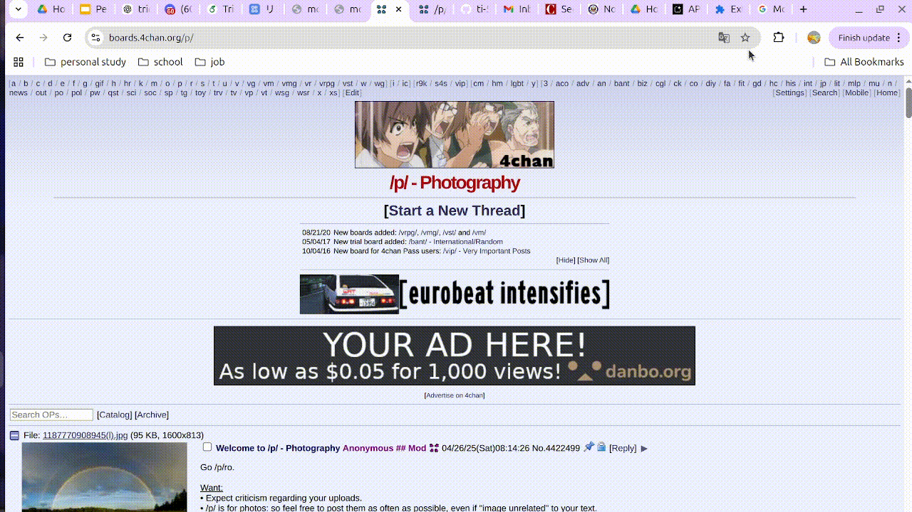

# PersonaLens

A Chrome extension + local Node backend prototype that uses Gemini API to simplify the **original webpage UI in-place**.

<p align="center">
  
</p>


## Project structure

```text
persona-lens-chatgpt/
  extension/
    manifest.json
    popup.html
    popup.css
    popup.js
    content.js
  backend/
    package.json
    .env.example
    server.js
```

## 1. Start the backend

```bash
cd backend
npm install
cp .env.example .env
```

Edit `.env`:

```bash
OPENAI_API_KEY=your_key_here
PORT=3000
```

Run:

```bash
npm run dev
```

The backend should run at:

```text
http://localhost:3000
```

The extension popup calls:

```text
http://localhost:3000/simplify
```

## 2. Load the Chrome extension

1. Open Chrome.
2. Go to `chrome://extensions`.
3. Enable **Developer mode**.
4. Click **Load unpacked**.
5. Select the `extension/` folder, not the whole project folder.
6. If you test by opening `demo/cluttered-gov-page.html` directly from disk, open the extension details page and enable **Allow access to file URLs**.
