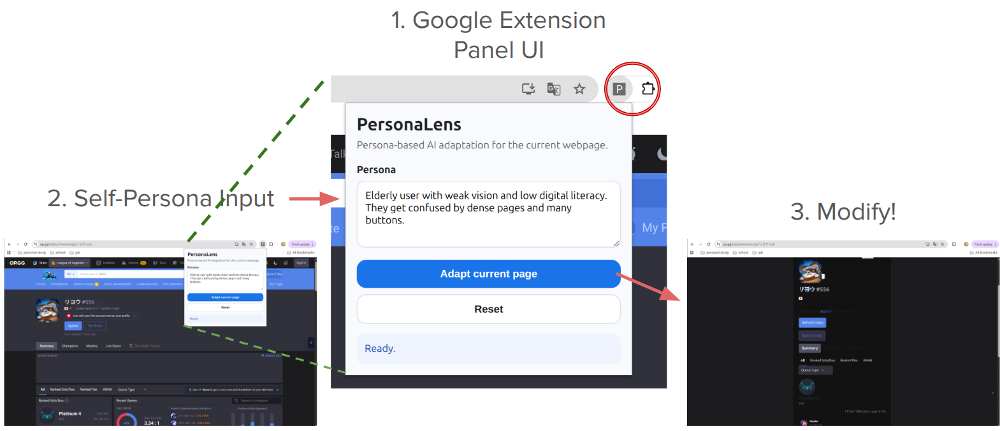

# Just4UI: PersonaLens

A Chrome extension tha simplifies the **original webpage UI in-place** based on an input user self-persona.

<p align="center">
  
</p>
<p align="center">
  
</p>

## Installation

### 1. Start the backend

```bash
cd backend
npm install
cp .env.example .env
```

Edit `.env`:

```bash
OPENAI_API_KEY=your_key_here
PORT=3000
```

Run:

```bash
npm run dev
```

The backend should run at:

```text
http://localhost:3000
```

The extension popup calls:

```text
http://localhost:3000/simplify
```

### 2. Load the Chrome extension

1. Open Chrome.
2. Go to `chrome://extensions`.
3. Enable **Developer mode**.
4. Click **Load unpacked**.
5. Select the `extension/` folder, not the whole project folder.

## Awards

1st Place @ **The Bridge Hackathon 2026 Japan x Korea GDGoC**
